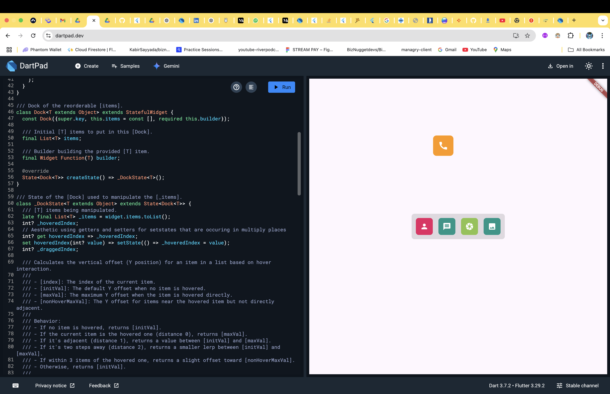

# Dock: A Simple Drag & Hover Icon Row in Flutter mimicking the macos icons

The `Dock` widget is a custom Flutter widget that displays a row of icons you can drag around and hover over. It’s built for fun and intuitive interaction — icons float up a bit when hovered and can be rearranged by dragging.

## What It Does

- **Drag to Reorder**  
  Move icons around by dragging one onto another — their positions update right away.
  
- **Hover Animations**  
  Hover over an icon, and it gently lifts to give feedback.

- **Fully Customizable**  
  Use any icons you like. The dock adapts to whatever you give it.

- **Smooth Animations**  
  Everything moves with clean transitions so it feels natural.

## Screenshot

## How It works

> _Icons sit in a horizontal row. Hovering makes one rise slightly. Dragging one lifts it, and dropping it on another swaps them._

## Try It Out

- **Live Demo**: [https://manuelalex.github.io/dock_web/](https://manuelalex.github.io/dock_web/)

- **Test on DartPad**: Copy-paste `main.dart` into [https://dartpad.dev/](https://dartpad.dev/) to run it instantly.

